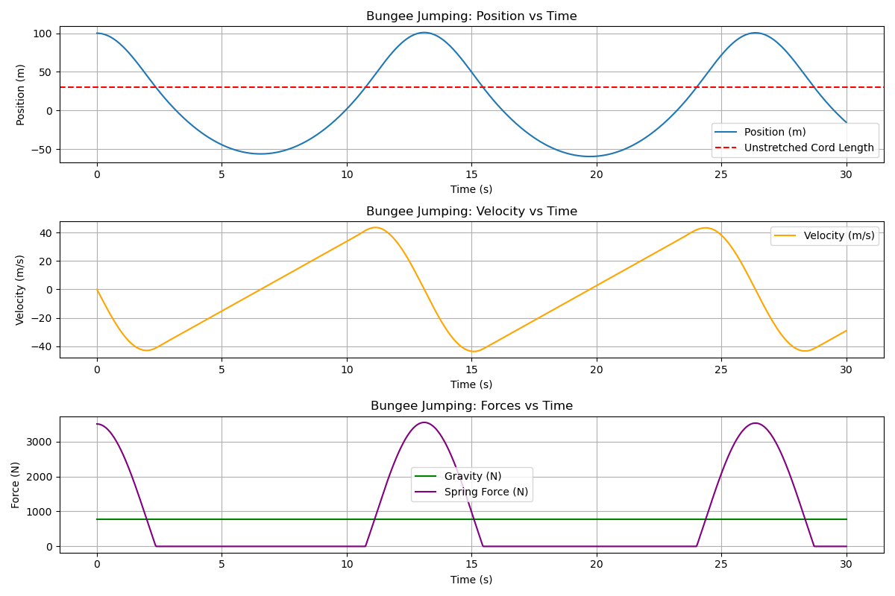

## Mathematical Model for Bungee Jumping(ODE)

#### Parameters

```
m: Mass of the Jumper
g: Acceleration due to gravity(9.8m/s^2)
k: Spring constant of the bungee cord
L: Unstretched lenght of the bungee cord
y(t): Vertical position of the jumper at time t
v(t): Velocity of the jumper
h: Height of the platform above the ground
```

- _The gravitational force acting down on the jumper is given by F<sub>g</sub> = mg._
- _The Spring force is applied when the cord is stretched and is given by <code>Hooke's law</code>:_
  <br>_F<sub>s</sub> = k.max(y(t)-L, 0)_
- _On free fall, only gravity acts on the body, the equation of the motion is:_
  <br><br>
  _d<sup>2</sup>y/dt<sup>2</sup> = g_

- _The velocity is given by:_
  <br><br> _v = gt_

- _The position is given by:_
  <br> <br> _y(t) = (1/2)gt<sup>2</sup>_

- _When y(t)>L, the cord is stretched, and both gravity and the spring force act on the jumper. The equation of motion becomes:_
  <br><br> _d<sup>2</sup>y/dt<sup>2</sup> = (1/2)gt<sup>2</sup>_

- _This is a second-order differential equation describing simple harmonic motion with a damping term._

- _The total mechanical energy of the system (jumper + cord) is conserved. At any point during the jump:_
  <br><br> _E = KE + Grav. Potential Energy + Elastic Potential Energy_
  <br>
  _i.e._
  <br><br> _E = (1/2)mv<sup>2</sup> + mgy + (1/2)k(y-L)<sup>2</sup>_
- _At the beginning_
  <br><br>_E = mgh_
- _At the lowest of the jump_
  <br><br> _E = mgy<sub>max</sub> + (1/2)k(y<sub>max</sub>-L)<sup>2</sup>_
- _The equation of the motion is:_
  <br><br> _d<sup>2</sup>y/dt<sup>2</sup> + ky/m = g + kL/m and the solution is:_
  <br><br> _y(t) = A cosωt + B sinωt + L + mg/k_
  <br> _where ω = &radic;k/m is the angular frequency of the oscillation_

- _Credits - [Deepseek](https://github.com/deepseek-ai) for assisting, Ayushi for bringing such idea;_
- _Output:_
  <br> <br>
